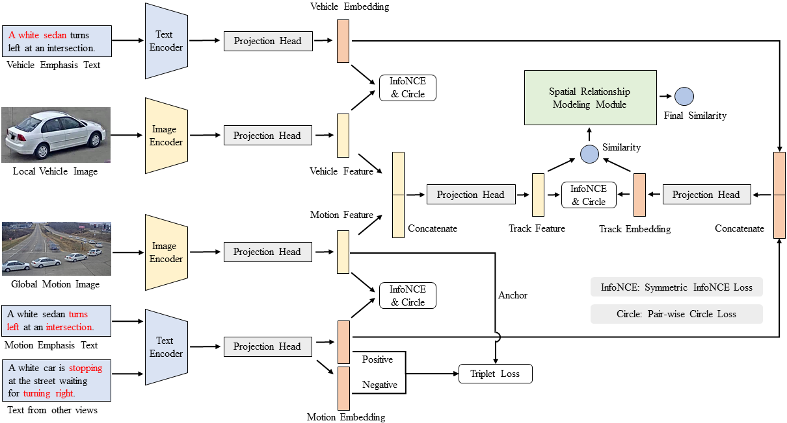

# Symmetric Network with Spatial Relationship Modeling for Natural Language-based Vehicle Retrieval

🏆 The 1st Place Solution for AICity2022 Challenge Track2: Natural Language-Based Vehicle Retrieval.

\[[official results](https://www.aicitychallenge.org/2022-challenge-winners/)\] \[[paper]([https://openaccess.thecvf.com/content/CVPR2022W/AICity/papers/Zhao_Symmetric_Network_With_Spatial_Relationship_Modeling_for_Natural_Language-Based_Vehicle_CVPRW_2022_paper.pdf](https://arxiv.org/pdf/2206.10879.pdf))\] \[[slides](https://drive.google.com/file/d/1UssQ81BzEUI_OGB_YmiQmk8Rl-0xtzO4/view?usp=sharing)\] \[[arxiv](https://arxiv.org/abs/2206.10879)\]



We have two codebases and get the final results with these two:

1. One is this repo: https://github.com/hbchen121/AICITY2022_Track2_SSM
2. Another is at here: https://github.com/ZhaoChuyang/AIC22-Track2-SMM


## Prepare
-  Preprocess the dataset to prepare `frames, motion maps, NLP augmentation`

` python3 scripts/extract_vdo_frms.py` to extract frames from dataset.

` bash scripts/iou.sh` to generate IOU-filtered motion maps.

` python3 scripts/deal_nlpaug.py` to perform NLP subject augmentation.

` python3 scripts/deal_nlpaug_2.py` to perform NLP motion augmentation.

` python3 scripts/deal_nlpaug_3.py` to perform NLP location augmentation.

-  Download checkpoints, extracted features and Spatial features. 

The directory structures in `data2022` and `checkpoints` are as follows：
```
.
├── checkpoints
│   ├── single_baseline_aug1.pth
│   ├── single_baseline_aug1_plus.pth
│   ├── single_baseline_aug2.pth
|   ├── circle_loss.pth
|   ├── view_triplet_hard.pth
│   ├── dual_baseline_aug1.pth
│   └── dual_baseline_aug3.pth
├── data2022
│   ├── train-tracks.json
│   ├── train-tracks_nlpaug.json    ## Subject augmentation (Refer to scripts/deal_nlpaug.py)
│   ├── train-tracks_nlpaug_2.json  # Motion augmentation (Refer to scripts/deal_nlpaug_2.py)
│   ├── train-tracks_nlpaug_3.json  # Location augmentation (Refer to scripts/deal_nlpaug_3.py)
│   └── ...
├── lang_img_feats
│   ├── img_lang_feat_single_baseline_aug1_plus.pth
│   └── ...
└── spatial_feat
    ├── query_lang_embeds.pkl
    └── track_car_embeds.pkl
```

## Train

The configuration files are in `configs` and train different models by (set up the right data path first):

```
bash run/single_baseline_aug1.sh
bash run/single_baseline_aug1_plus.sh
bash run/single_baseline_aug2.sh
bash run/circle_loss.sh
bash run/view_triplet_hard.sh
bash run/dual_baseline_aug3.sh
```

You can also change the `RESTORE_FROM` in your configuration file to checkpoints, and load checkpoints to eval (download the checkpoints first).
Take `dual_baseline_aug1` as an example:

```
bash run/eval_only.sh
```


## Ensemble and Submit  

Change the `RESTORE_FROM` in your configuration file to the checkpoints downloaded [here](https://drive.google.com/drive/folders/1J05FnYwbmh839bMVRK_xeo9P_twRz5gL?usp=sharing), load these model and extract the embeddings.

Or you can obtain the features directly form [here](https://drive.google.com/drive/folders/195E3mtzRE4LRGMgT1L4nHCCn8brq4t7r?usp=sharing) and save to `extracted_feats`.

In addition, acquire the car and text features used in short-distance modeling, run code in codebase2 or download the spatial features from [here](https://drive.google.com/drive/folders/1UIb4_YDJaGxER7qRhTtBoayMitzAndbz?usp=sharing) and save to dir `spatial_feats`.
```
base run/submit.py
```

## Others

If you have any questions, please leave an issue or contact us: hbchen121@gmail.com or cy.zhao15@gmail.com

```
@InProceedings{Zhao_2022_CVPR,
    author    = {Zhao, Chuyang and Chen, Haobo and Zhang, Wenyuan and Chen, Junru and Zhang, Sipeng and Li, Yadong and Li, Boxun},
    title     = {Symmetric Network With Spatial Relationship Modeling for Natural Language-Based Vehicle Retrieval},
    booktitle = {Proceedings of the IEEE/CVF Conference on Computer Vision and Pattern Recognition (CVPR) Workshops},
    month     = {June},
    year      = {2022},
    pages     = {3226-3233}
}
```

## Acknowledgement

Our approach partially borrows from the [AIC2021-T5-CLV](https://github.com/ShuaiBai623/AIC2021-T5-CLV). Thanks for their excellent work!
